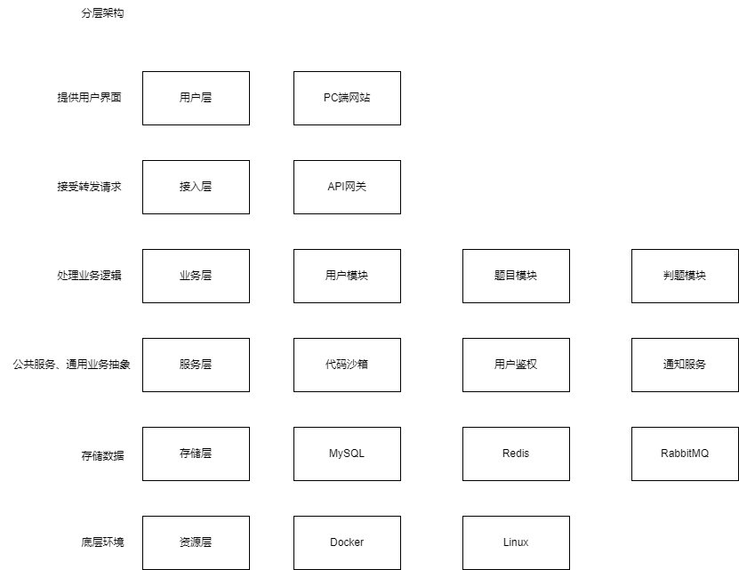
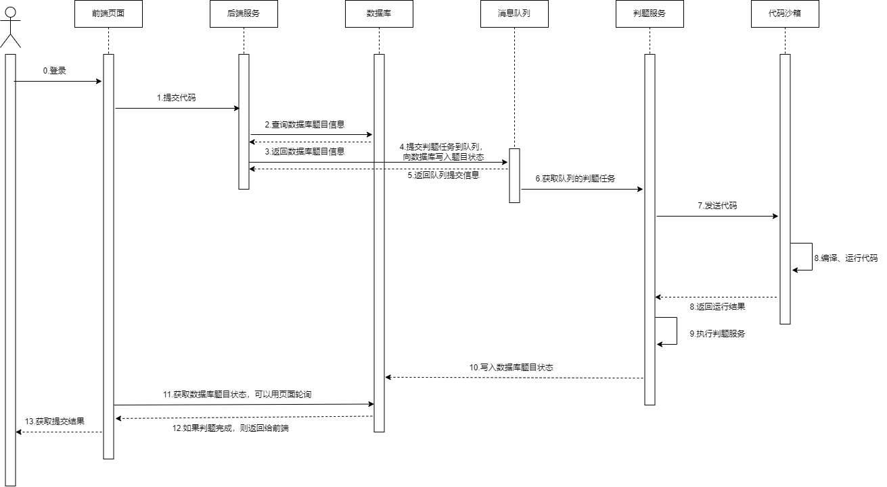
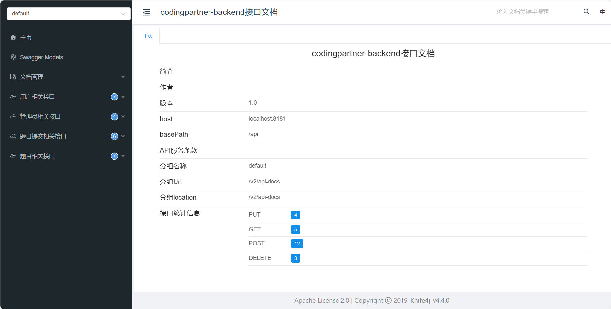

# CodingPartner Backend

## 项目简介
codingpartner是oj系统，由codingpartner-backend和codingpartner-frontend两个子项目组成。
利用代码沙箱在线判题的方式，实现在线编程。 
管理员可以创建题目，管理用户，查看提交记录等。 
用户可以提交代码，查看提交记录等。

## 核心业务流程

## 架构设计

## 时序图

## API 文档

http://localhost:8181/api//v2/api-docs

http://localhost:8181/api/doc.html

