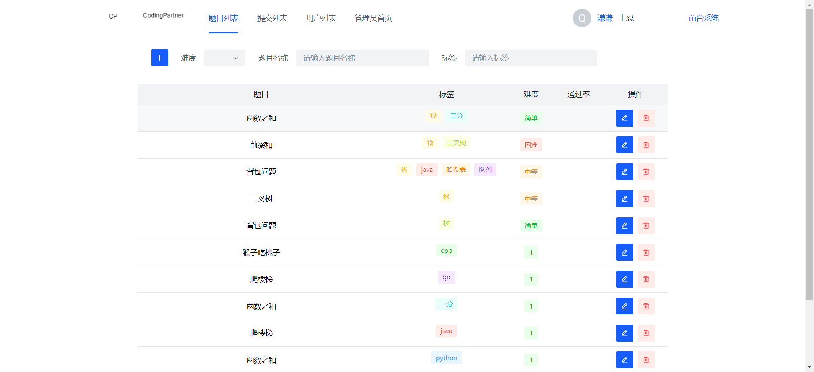
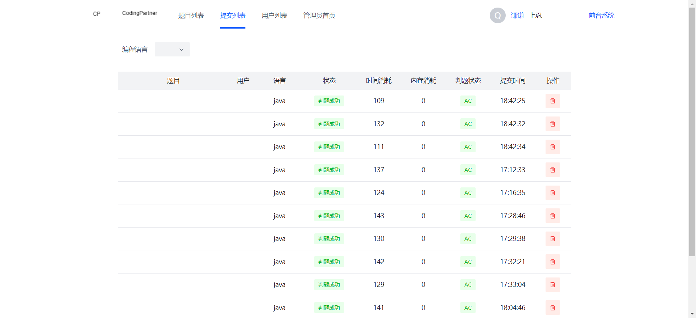
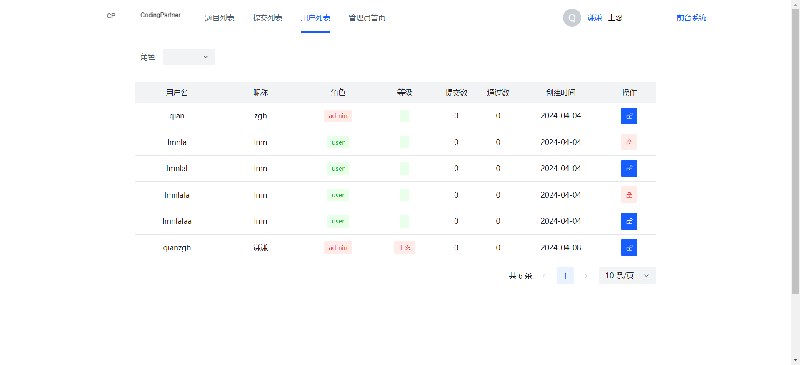
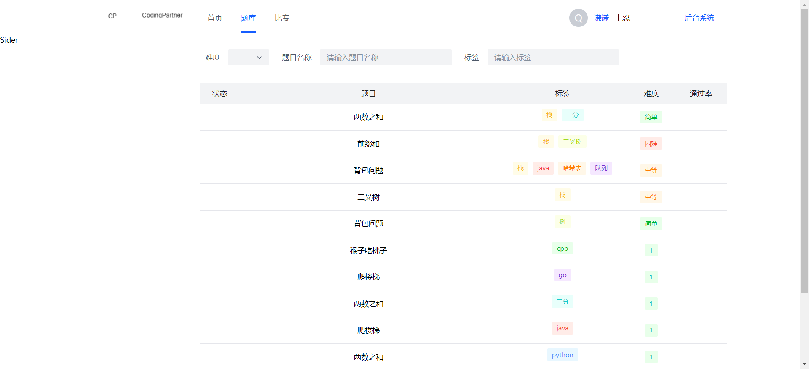
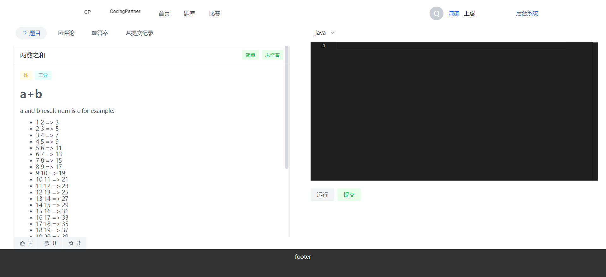
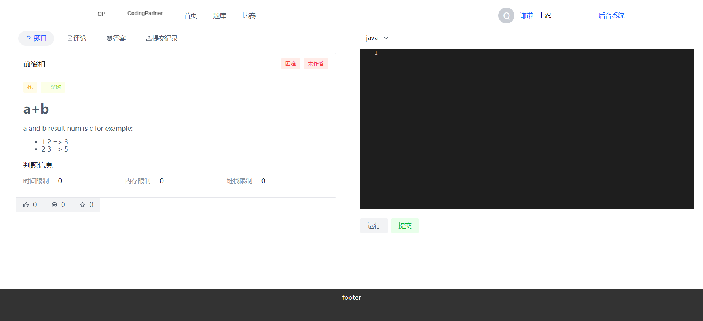
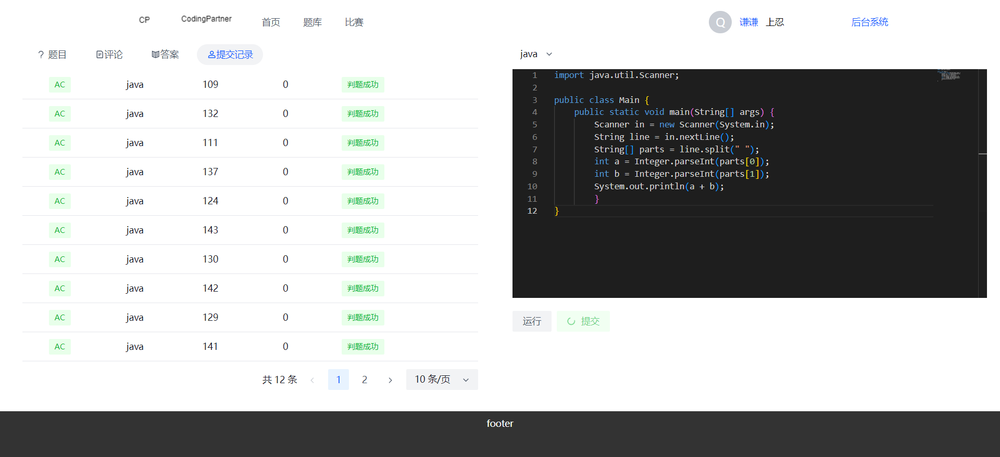

# codingpartner
codingpartner是oj系统，由codingpartner-backend和codingpartner-frontend两个子项目组成。
利用代码沙箱在线判题的方式，实现在线编程。
管理员可以创建题目，管理用户，查看提交记录等。
用户可以提交代码，查看提交记录等。

# codingpartner-frontend
## 项目介绍
这是codingpartner前端工程
## 页面截图

### 管理员-题目列表页面



### 管理员-提交页面



### 管理员-用户列表页面



### 题库页面



### 题目页面



### 题目页面2



### 题目页面3




# 运行项目

## Project setup
```
yarn install
```
## Compiles and hot-reloads for development
```
yarn serve
```
## Compiles and minifies for production
```
yarn build
```
## Lints and fixes files
```
yarn lint
```
